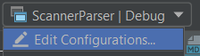
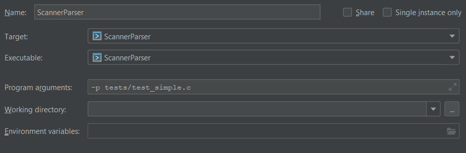

# C 2 MIPS

For CS 460, Compiler Construction, Fall 2018

### Description:

This project is a C Compiler that translates ANSI C code into 
MIPS Assembly code. The Compiler currently consists of a Symbol
Table, Scanner, Parser, and Abstract Syntax Tree. The Symbol Table works 
with the Scanner and Parser to keep track of identifiers read from an 
input character stream. The Scanner returns tokens from an input character stream. 
The Parser uses the tokens from the Scanner to generate productions based
on the C Grammar. The Abstract Syntax Tree produces a tree of nodes
The compiler is written in C++ and uses Flex and Bison
to scan and parse the input C code. More detailed project information can
be found in the [wiki](https://derekdstratton.github.io/C-2-MIPS).

### Team: Scan

- Derek Stratton
- Chris Koh

### Installation on an ECC Machine: 

```
git clone https://github.com/derekdstratton/C-2-MIPS
cmake C-2-MIPS
make
```

### Usage:

##### Running on an ECC Machine:
- To run the Scanner/Parser, type `./ScannerParser [options] c_file_path` More info
on the options can be found in the [wiki](https://derekdstratton.github.io/C-2-MIPS/). 
c_file_path is the path of the C file being compiled. 
- To run the Symbol Table driver, type `./SymbolTableDriver`
- To run the Symbol Table Test driver, type `./SymbolTableTest`

##### Running from within CLion:
- To run the Scanner/Parser, go to the top right, select `ScannerParser` and
select `Edit Configurations`

    
    
    Make sure the target and executable are set to ScannerParser. Add program 
    arguments in the format `[options] c_file_path` More info
    on the options can be found in the [wiki](https://derekdstratton.github.io/C-2-MIPS/).
    c_file_path is the path of the C file being compiled. 
    
    
    
    Click the green arrow to run the program
    
- To run the Symbol Table driver, change the Run Configuration in the top-right
to `SymbolTableDriver` and click the green arrow to run
- To run the Symbol Table Test driver, change the Run Configuration in the top-right
to `SymbolTableTest` and click the green arrow to run

### Wiki:

https://derekdstratton.github.io/C-2-MIPS
